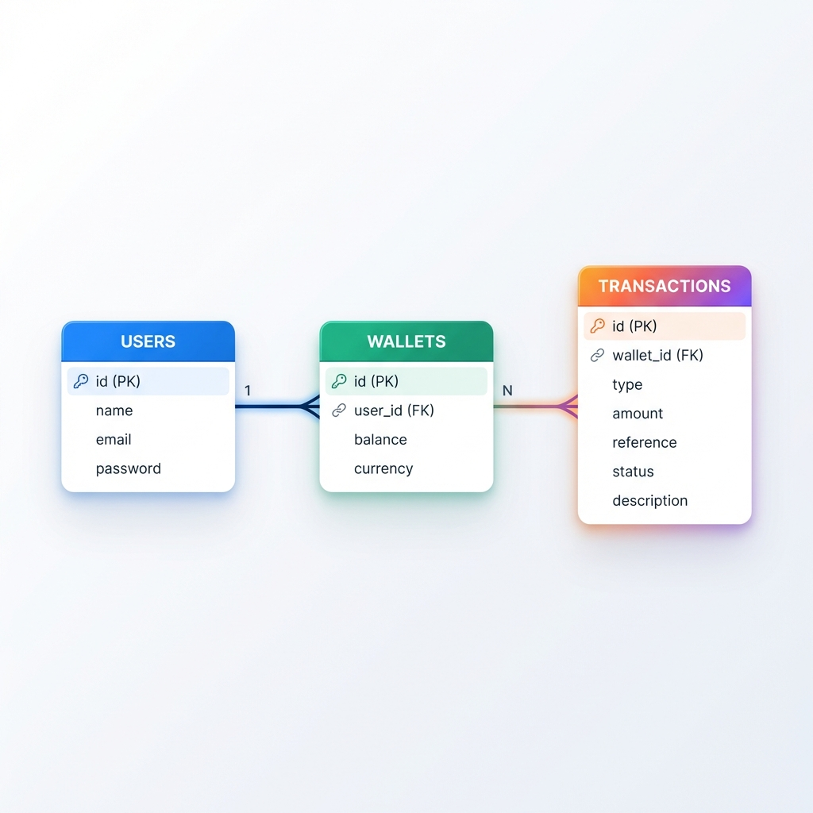

# Demo Credit (MVP) - Wallet-based Lending Service

This is a Minimum Viable Product for a wallet-based lending service built with NodeJS, TypeScript, MySQL, and KnexJS.

## Features
- **Account Creation**: Secure checking against Adjutor Karma Blacklist.
- **Funding**: Credit funds to wallet.
- **P2P Transfer**: Transfer funds between users with transactional integrity.
- **Withdrawal**: Debit funds.
- **Security**: Faux-token based authentication (JWT) and secure headers.

## Setup Instructions

1.  **Prerequisites**: Node.js (LTS), MySQL Database.
2.  **Install Dependencies**:
    ```bash
    npm install
    ```
3.  **Environment Setup**:
    Copy `.env` (already created) and update DB credentials if needed.
    ```env
    DB_HOST=127.0.0.1
    DB_USER=root
    DB_PASSWORD=yourpassword
    DB_NAME=demo_credit
    ```
4.  **Database Migration**:
    ```bash
    npm run migrate
    ```
    *Note: Ensure MySQL is running and the database `demo_credit` exists.*

5.  **Run Application**:
    ```bash
    npm run dev
    ```

## Database Design

The application uses a relational schema with **Users**, **Wallets**, and **Transactions**. Below is the Entity-Relationship Diagram:



*Textual Representation:*
- **Users**: Central identity table.
- **Wallets**: Holds balance, linked to User via `user_id`. One user has one wallet (MVP).
- **Transactions**: Double-entry record for every balance change (Credit/Debit).

## Architecture
- **Layered Architecture**: Controllers -> Services -> Data Access.
- **Transactions**: KnexJS transactions ensure atomic operations for all financial movements.

## Testing & Verification

The project employs a robust testing strategy combining Unit Tests for logic validation and Integration Tests for end-to-end system verification.

### 1. Integration Tests (End-to-End)
A custom script (`integration-test.js`) simulates a real-world usage scenario against the running API.

**Prerequisites:**
- Ensure the server is running (`npm run dev`) in a separate terminal.

**Run the Test:**
```bash
node integration-test.js
```

**Test Scenario / Coverage:**
The `integration-test.js` script automatically executes the following sequence:
1.  **User A Registration (Sender)**: Registers a new user (verifies blacklist check passes).
2.  **User B Registration (Receiver)**: Registers a second user.
3.  **Wallet Funding**: Credits User A's wallet with **5,000**.
4.  **Transfer**: User A transfers **1,000** to User B (Atomic Transaction).
5.  **Withdrawal**: User A withdraws **500**.
6.  **Balance Reconciliation**: Verifies User A's final balance is exactly **3,500**.
    > *Formula: 5000 (Fund) - 1000 (Transfer) - 500 (Withdraw) = 3500*

### 2. Unit Tests
Core business logic in `src/services/` is tested using Jest to ensure reliability and handle edge cases.

**Run Unit Tests:**
```bash
npm test
```

**Test Cases Covered:**
- **Wallet Funding**:
  - `should fund a wallet successfully`: Verifies credit transaction and balance update.
  - `should throw error if wallet not found`: Verifies invalid user handling.
- **Wallet Withdrawal**:
  - `should withdraw successfully if balance is sufficient`: Verifies debit transaction and balance check.
  - `should fail if insufficient funds`: Verifies overdraft protection mechanism.

## Additional Documentation
For a detailed engineering breakdown, including specific technical decisions, challenges encountered (e.g., TS migration quirks), and fixes, please refer to:
- [REVIEW.md](./REVIEW.md)
